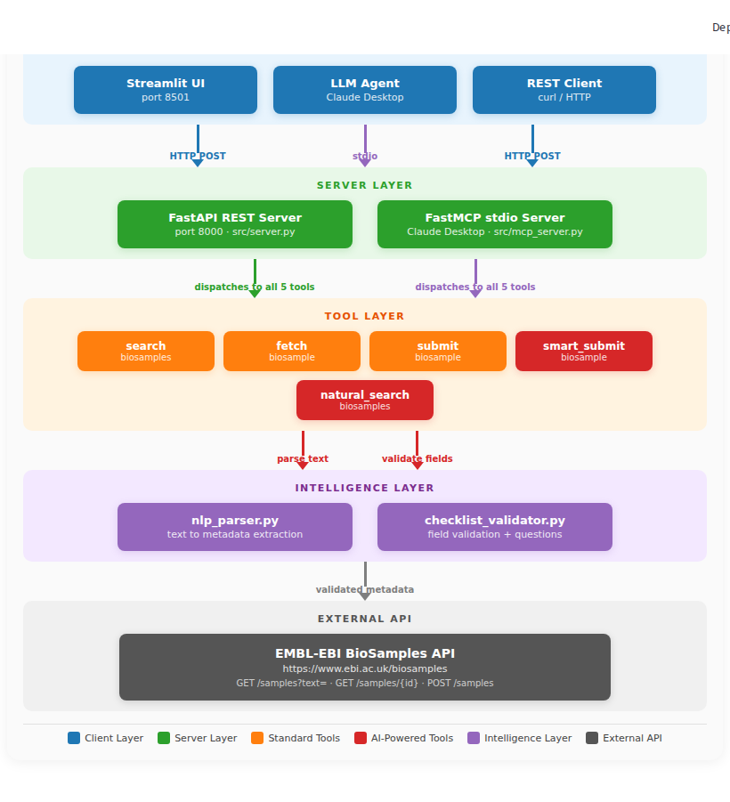
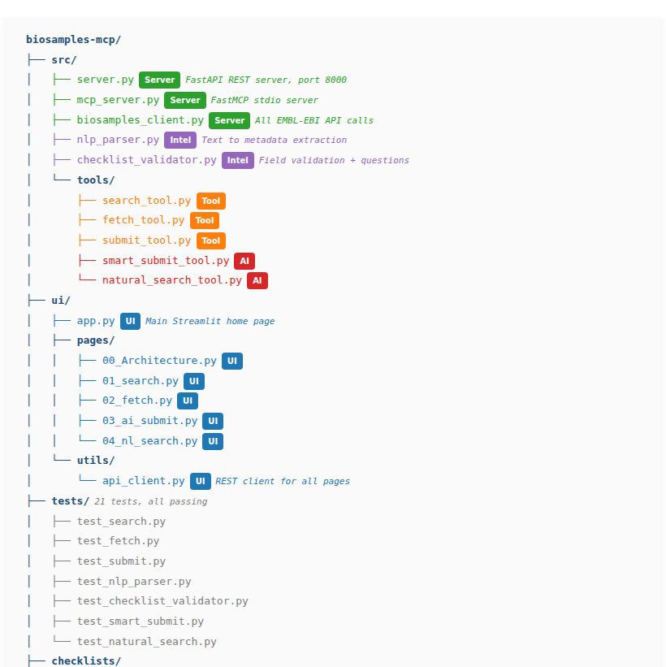

# biosamples-mcp

     

A production-ready MCP server that connects AI agents to the EMBL-EBI BioSamples database — enabling intelligent biological sample search, metadata validation, and submission through a clean tool interface.

## Why This Project Matters

Biological sample metadata stored in public repositories like EMBL-EBI BioSamples is rich but difficult to access programmatically. Researchers at hospitals, pharmaceutical companies, and academic institutions spend significant time manually searching, validating, and submitting sample data through web interfaces — a process that does not scale.

This project implements the Model Context Protocol (MCP) as a structured bridge between AI agents and the BioSamples REST API. By defining explicit tool schemas with validated inputs and outputs, it allows any LLM-based system to interact with BioSamples programmatically — without hallucinations, without manual data entry, and with full traceability back to the authoritative data source.

The server is not a prototype. Two biological samples (SAMEA122005222 and SAMEA122005223) were submitted live to the EMBL-EBI BioSamples database during development, confirming end-to-end functionality against the production API.

## Architecture

The system is organised in five layers. Each layer has a single responsibility. Full interactive diagrams with color coding are available in the Streamlit UI under **Architecture**.

### System Overview



### Layer 1 — Client Layer
Three types of clients can connect to the server:
- **Streamlit UI** (port 8501) — visual interface for demos
- **LLM Agent** via Claude Desktop — AI agent using stdio transport
- **REST Client** — direct curl or API calls over HTTP

### Layer 2 — Server Layer
Two server transports handle incoming requests:
- **FastAPI REST Server** (port 8000) — handles HTTP clients. File: `src/server.py`
- **FastMCP stdio Server** — handles Claude Desktop connections. File: `src/mcp_server.py`

### Layer 3 — Tools Layer
Five MCP tools process all requests:

Standard tools:
- `search_biosamples` — keyword search across BioSamples
- `fetch_biosample` — retrieve full metadata by accession
- `submit_biosample` — submit structured sample metadata

AI-powered tools:
- `smart_submit_biosample` — submit from plain English text
- `natural_search_biosamples` — search using natural language

### Layer 4 — Intelligence Layer
Two modules power the AI-assisted tools:
- `nlp_parser.py` — extracts organism, tissue, disease, location, and date from plain English descriptions
- `checklist_validator.py` — validates extracted fields against BioSamples checklists and generates clarification questions for missing required fields

### Repository File Structure



### Layer 5 — External API
All tools ultimately call the EMBL-EBI BioSamples REST API:
- `GET  /biosamples/samples?text={query}` — search
- `GET  /biosamples/samples/{accession}` — fetch
- `POST /biosamples/samples` — submit
- Base URL: https://www.ebi.ac.uk/biosamples
- Client file: `src/biosamples_client.py`

## Live Demo Evidence

The following samples were submitted to the EMBL-EBI BioSamples production database during development, confirming that the submission pipeline works end-to-end:

| Accession | Description | Submitted via |
|-----------|-------------|---------------|
| SAMEA122005222 | Human blood sample, Germany | submit_biosample (structured) |
| SAMEA122005223 | Human liver biopsy, London, cirrhosis | smart_submit_biosample (plain English) |

View live: https://www.ebi.ac.uk/biosamples/samples/SAMEA122005222

View live: https://www.ebi.ac.uk/biosamples/samples/SAMEA122005223

## Web Interface

A professional Streamlit UI provides a visual interface for all 5 MCP tools — useful for demos, interviews, and exploring the BioSamples database without writing any code.

### Architecture


The Architecture page provides a complete visual overview of how all system components connect and communicate, including the AI-assisted submission workflow and the full repository file structure.

### Home


Overview of available tools and live server status.

### Search Samples


Keyword search across the EMBL-EBI BioSamples database with clickable accession links.

### Fetch Sample Details


Retrieve complete metadata for any BioSamples accession.

### AI-Assisted Submission


Submit samples from plain English descriptions with automatic metadata extraction and checklist validation.

### Natural Language Search


Query samples using conversational language — the server parses filters automatically and shows the interpretation alongside the results.

### Quick Start with UI

```bash
# Terminal 1: Start the MCP REST server
export $(cat .env) && uvicorn src.server:app --reload

# Terminal 2: Start the Streamlit UI
streamlit run ui/app.py
```

Open http://localhost:8501 in your browser.

## Quick Start

```bash
# Clone the repository
git clone https://github.com/Anas9-8/biosamples-mcp
cd biosamples-mcp

# Copy environment file and add your token (only needed for submit)
cp .env.example .env

# Start with Docker Compose
docker-compose up --build

# Check it's running
curl http://localhost:8000/health
# {"status": "ok", "version": "1.0.0"}

# List available tools
curl http://localhost:8000/tools
```

## MCP Tools Reference

| Tool | Purpose | Input | Output |
|------|---------|-------|--------|
| `search_biosamples` | Keyword search across BioSamples | `query: str` | List of matching samples |
| `fetch_biosample` | Full metadata by accession | `accession: str` | Complete sample record |
| `submit_biosample` | Submit structured sample | metadata fields + AAP token | Assigned accession |
| `smart_submit_biosample` | Submit from plain English | `description: str` | Accession or clarification questions |
| `natural_search_biosamples` | NL query to structured search | `query: str` | Filtered results + interpretation |

### Example: Search

```bash
curl -X POST http://localhost:8000/tools/search_biosamples/call \
  -H "Content-Type: application/json" \
  -d '{"query": "human lung cancer", "organism": "Homo sapiens"}'
```

### Example: Fetch

```bash
curl -X POST http://localhost:8000/tools/fetch_biosample/call \
  -H "Content-Type: application/json" \
  -d '{"accession": "SAMEA112654119"}'
```

## AI-Assisted Submission Workflow


The `smart_submit_biosample` tool processes plain English descriptions through a 7-step pipeline:

**Step 1 — User Input.**
The user provides a plain English description of the sample.
Example: *"Human liver biopsy collected in London in 2023 from a patient with cirrhosis"*

**Step 2 — Text Extraction** (`nlp_parser.py`).
The NLP parser extracts structured metadata fields: organism, tissue, disease, geographic location, collection date.

**Step 3 — Checklist Validation** (`checklist_validator.py`).
The validator checks extracted fields against the selected BioSamples checklist:
- `default` checklist: requires organism and taxon_id
- `human_sample` checklist: requires organism, taxon_id, tissue, and collection_date

**Step 4a — Clarification** (if fields are missing).
If required fields are missing, the tool returns targeted questions to the user instead of submitting an incomplete record.
Example questions: *"When was this sample collected? (YYYY-MM-DD)"*, *"What is the patient sex? (male/female/unknown)"*

**Step 5 — Merge and Revalidate.**
The user's answers are merged with the extracted metadata and the checklist validation runs again.

**Step 6 — Submission.**
Once all required fields are present, `submit_sample()` sends a POST request to the EMBL-EBI BioSamples API with the complete metadata in HAL+JSON format.

**Step 7 — Success.**
The EMBL-EBI API assigns a permanent accession identifier.
Examples from this project: SAMEA122005222, SAMEA122005223

## Use Cases

Clinical research departments can use this server to programmatically search public sample datasets for cohort comparisons, reducing manual database queries and enabling AI-assisted literature-linked sample discovery.

Drug development teams can integrate this MCP server into their data pipelines to find relevant disease model samples, validate sample metadata quality, and submit new experimental samples to the global repository — all through a standardised AI tool interface.

Research groups can connect LLM-based analysis assistants directly to BioSamples data without building custom API integrations. The MCP tool interface provides deterministic, hallucination-free access to authoritative biological data.

This project was independently developed as a working implementation of the EMBL-EBI GSoC 2026 project idea "Expose BioSamples Submission and Search Capabilities as MCP Tools for AI-Assisted Metadata Interaction" (Mentor: Dipayan Gupta). Reference: https://www.ebi.ac.uk/about/events/gsoc/

## Roadmap

The current implementation covers the core submission and search capabilities described in the project specification. Planned extensions include integration with the live BioSamples checklist API to replace the static JSON files, multi-turn conversational session management for complex submission workflows, rate-limit-aware caching for high-volume queries, and expansion to additional EMBL-EBI resources including ENA and ArrayExpress.

## Tech Stack

- **Python 3.11** — type hints throughout, modern async patterns
- **FastAPI** — async HTTP server with automatic OpenAPI docs
- **httpx** — async HTTP client for BioSamples API calls
- **Pydantic v2** — data validation for tool inputs and outputs
- **MCP SDK** — Model Context Protocol integration
- **Docker** — containerised deployment with non-root user
- **GitHub Actions** — CI on every push to main

## Local Development

```bash
# Install dependencies
pip install -r requirements.txt

# Run the server locally
uvicorn src.server:app --reload

# Run tests
pytest tests/ -v

# Lint
ruff check src/
```
