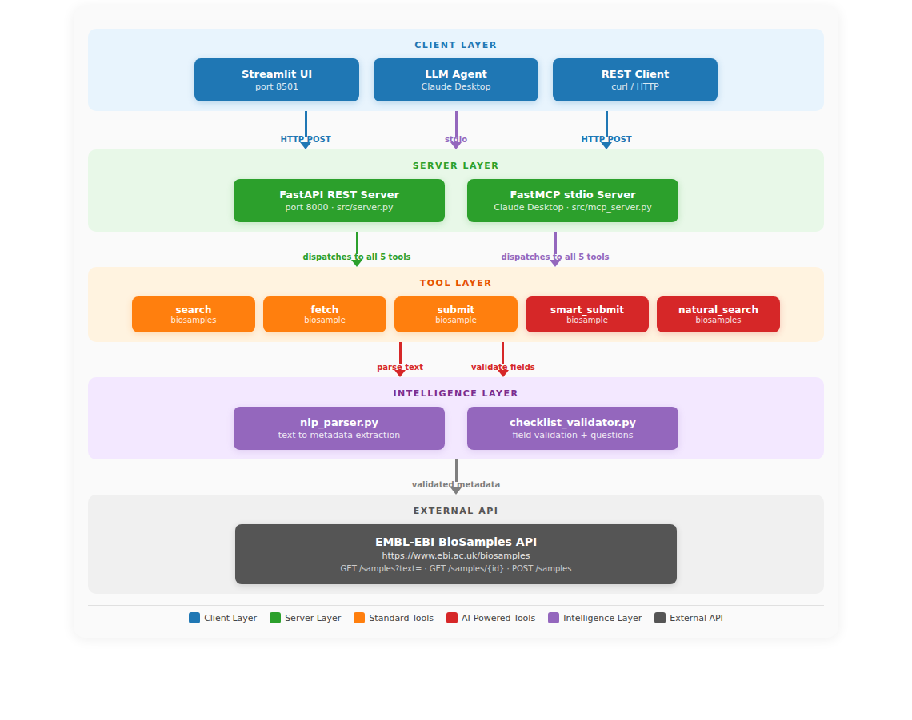
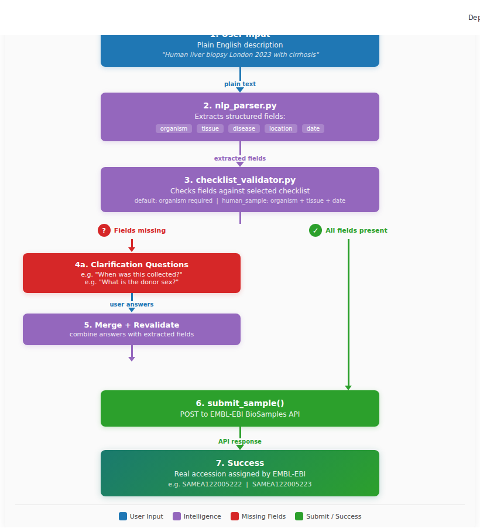
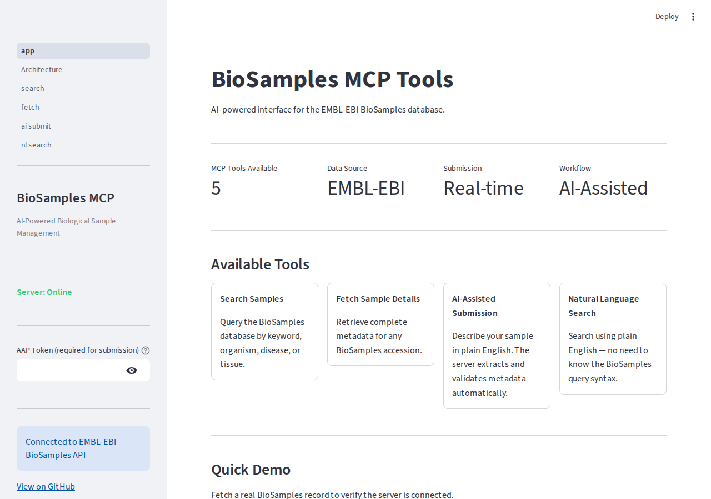
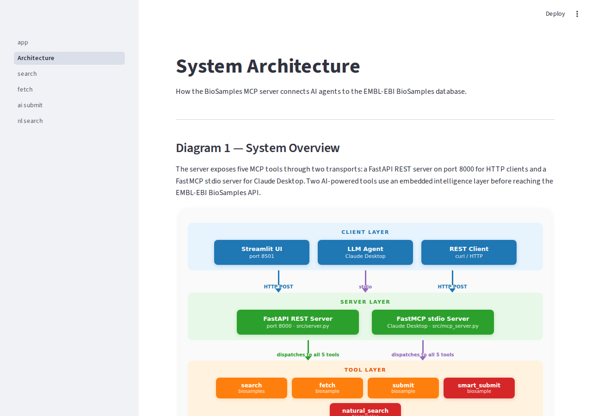
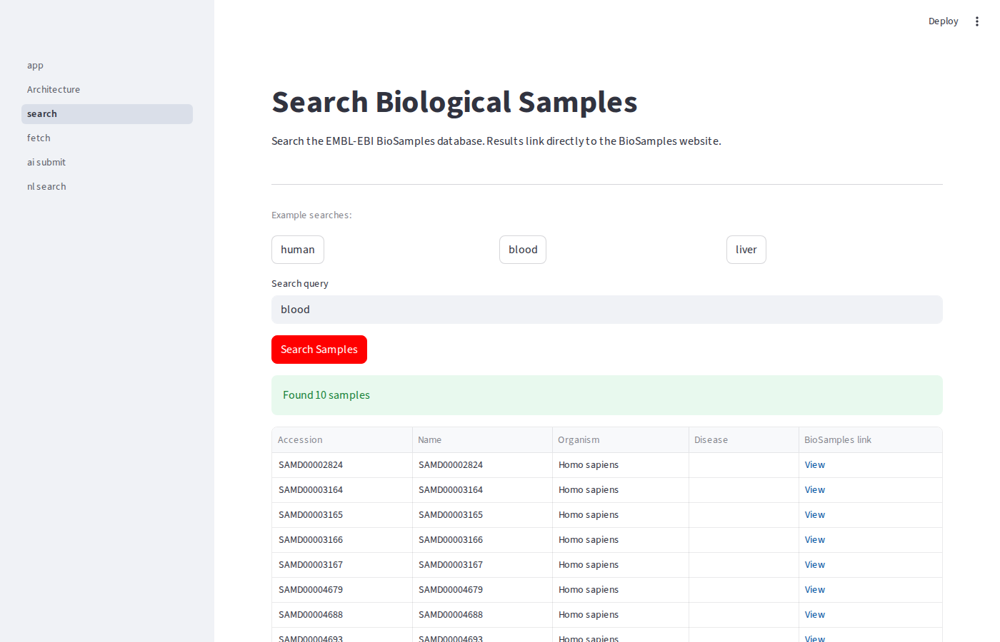
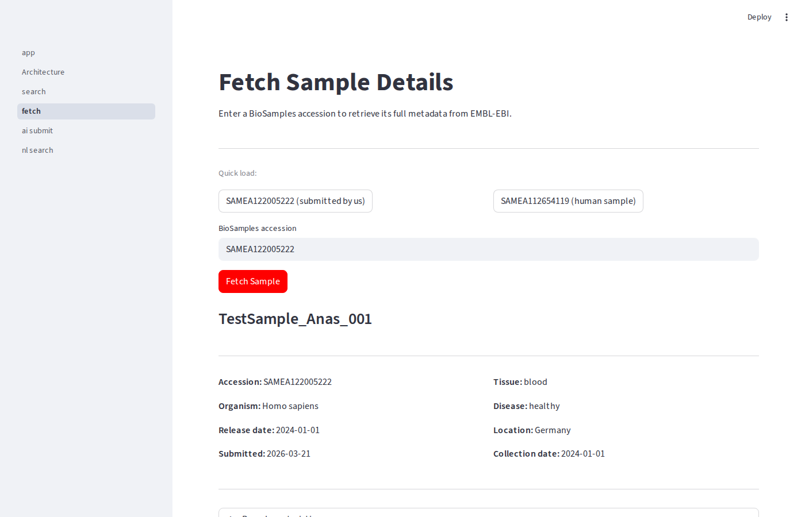
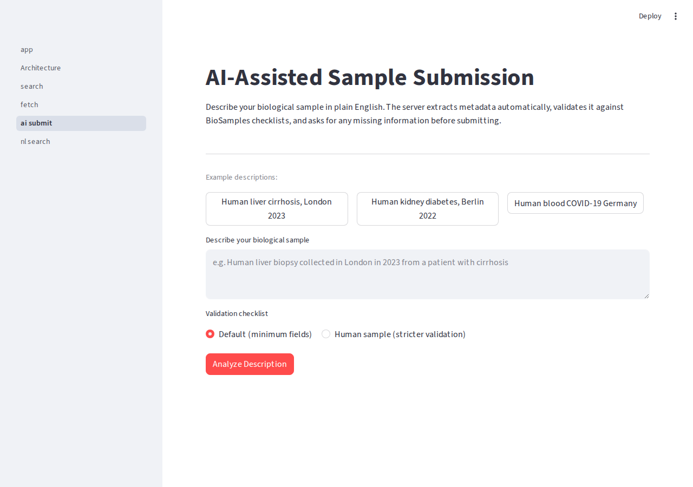
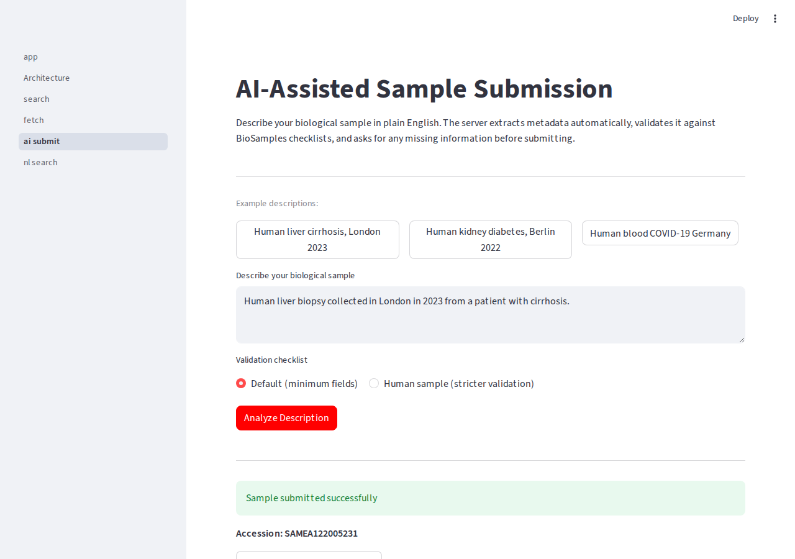
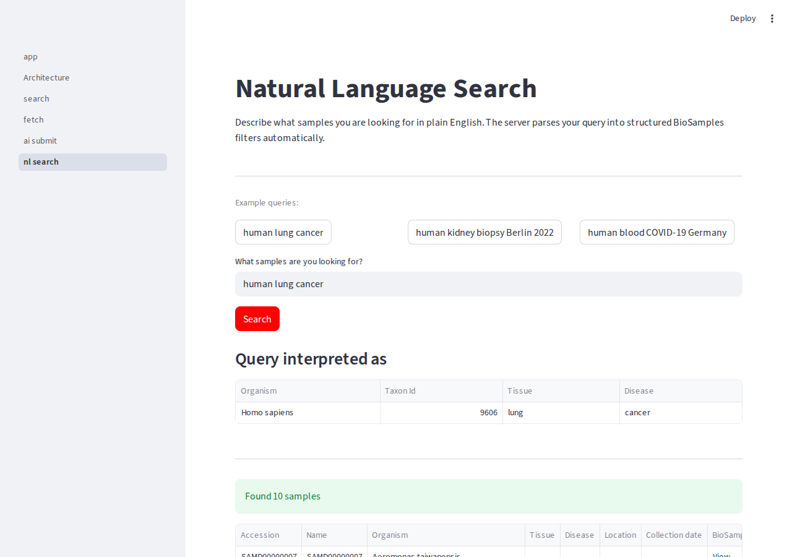

# biosamples-mcp

     

An MCP server that gives AI agents structured, traceable access to the EMBL-EBI BioSamples database. Search, fetch, and submit biological sample metadata without touching a web browser.

## Table of Contents

- [Why This Project Matters](#why-this-project-matters)
- [System Architecture](#system-architecture)
  - [Diagram 1 - System Overview](#diagram-1--system-overview)
  - [Diagram 2 - Submission Workflow](#diagram-2--ai-assisted-submission-workflow)
  - [Diagram 3 - File Structure](#diagram-3--repository-file-structure)
- [Live Demo Evidence](#live-demo-evidence)
- [Web Interface](#web-interface)
  - [Home Page](#home-page)
  - [Architecture Page](#architecture-page)
  - [Search Samples](#search-samples)
  - [Fetch Sample Details](#fetch-sample-details)
  - [AI-Assisted Submission](#ai-assisted-submission)
  - [Natural Language Search](#natural-language-search)
- [Quick Start](#quick-start)
- [MCP Tools Reference](#mcp-tools-reference)
- [Use Cases](#use-cases)
- [Roadmap](#roadmap)
- [Tech Stack](#tech-stack)
- [Local Development](#local-development)

## Why This Project Matters

BioSamples holds metadata for millions of biological samples from labs and hospitals worldwide. The REST API works fine for direct queries, but AI agents cannot use it reliably, they need explicit tool schemas, defined inputs, and predictable outputs to avoid making things up.

This project wraps the BioSamples API in an MCP server. Each tool has a strict schema. Every response comes directly from the API. The smart submission tool adds a small NLP layer that extracts structured fields from plain English text, useful when a researcher wants to describe a sample in their own words rather than fill in a form.

Two samples were submitted to the production database during development: SAMEA122005222 and SAMEA122005223. Both are publicly visible on the EMBL-EBI website, which confirms the submission pipeline works against the real API.

## System Architecture

The following diagrams show how all components of the system connect and communicate. Each layer is color-coded: blue for clients, green for servers, orange for standard tools, red for AI-powered tools, purple for the intelligence layer, and gray for the external API.

---

### Diagram 1 — System Overview




- Three client types: Streamlit UI on port 8501, Claude Desktop via stdio, and any REST client
- FastAPI REST server (port 8000) handles HTTP traffic; FastMCP handles Claude Desktop
- Five MCP tools, three standard and two AI-powered
- nlp_parser.py and checklist_validator.py sit behind the two smart tools
- Everything ultimately hits the EMBL-EBI BioSamples REST API

---

### Diagram 2 — AI-Assisted Submission Workflow




- Step 1: User writes a plain English sample description
- Step 2: nlp_parser.py extracts organism, tissue, disease, location, and date automatically
- Step 3: checklist_validator.py checks required fields
- Step 4: If fields are missing, clarification questions are returned to the user
- Step 5: User answers are merged with extracted metadata
- Step 6: Complete record is submitted to EMBL-EBI API
- Step 7: Real BioSamples accession is returned

---

### Diagram 3 — Repository File Structure


- src/ contains the servers, tools, NLP parser, and checklist validator
- ui/ has the Streamlit app and five page modules
- 21 tests in tests/, all passing
- checklists/ holds the two validation JSON files (default + human_sample)
- Docker and docker-compose for one-command deployment
- GitHub Actions CI runs on every push to main

---

## Live Demo Evidence

These two samples were submitted to the real EMBL-EBI BioSamples database during development:

| Accession | Description | Submitted via |
|-----------|-------------|---------------|
| SAMEA122005222 | Human blood sample, Germany | submit_biosample (structured) |
| SAMEA122005223 | Human liver biopsy, London, cirrhosis | smart_submit_biosample (plain English) |

View live: https://www.ebi.ac.uk/biosamples/samples/SAMEA122005222

View live: https://www.ebi.ac.uk/biosamples/samples/SAMEA122005223

## Web Interface

The Streamlit interface provides visual access to all five MCP tools. The following screenshots show each page with a brief description of its key features.

Start the interface:

```bash
# Terminal 1 — start the MCP server
export $(cat .env) && uvicorn src.server:app --reload

# Terminal 2 — start the Streamlit UI
pip install -r requirements-ui.txt
streamlit run ui/app.py
```

Open http://localhost:8501 in your browser.

---

### Home Page




- Server status indicator, green when the MCP server is reachable on port 8000
- All five tools listed with one-line descriptions
- Quick demo: click to fetch SAMEA122005222 and confirm the connection is live

---

### Architecture Page




- Three color-coded diagrams covering system overview, submission workflow, and file structure
- Rendered as live HTML in the browser, not static images
- Works well in technical presentations and interview demos

---

### Search Samples




- Full-text keyword search across the BioSamples database
- Results table with accession, organism, and disease columns
- Accession IDs link straight to the EMBL-EBI record page
- One-click example queries: "human", "blood", "liver"

---

### Fetch Sample Details




- Paste any accession to pull the full metadata record
- Two-column layout separating basic info from biological attributes
- Raw characteristics available in an expandable section
- Buttons pre-loaded with SAMEA122005222 and SAMEA122005223 for quick testing

---

### AI-Assisted Submission






- Write a sample description in plain English instead of filling out a form
- The NLP parser pulls out organism, tissue, disease, location, and date automatically
- Choose between default (minimum fields) or human_sample (stricter) checklist
- Missing fields trigger specific clarification questions
- Once everything checks out, the sample is submitted and the accession comes back
- SAMEA122005222 and SAMEA122005223 were both submitted through this page

---

### Natural Language Search




- Type a query in plain English, no special syntax
- The server shows which filters it extracted (organism, tissue, disease, location)
- Results come back with accession, organism, tissue, and disease columns
- Example buttons: "human lung cancer", "human kidney biopsy Berlin 2022", "human blood COVID-19 Germany"

---

## Quick Start

```bash
# Clone the repository
git clone https://github.com/Anas9-8/biosamples-mcp
cd biosamples-mcp

# Copy environment file and add your token (only needed for submit)
cp .env.example .env

# Start with Docker Compose
docker-compose up --build

# Check it's running
curl http://localhost:8000/health
# {"status": "ok", "version": "1.0.0"}

# List available tools
curl http://localhost:8000/tools
```

## MCP Tools Reference

| Tool | Purpose | Input | Output |
|------|---------|-------|--------|
| `search_biosamples` | Keyword search across BioSamples | `query: str` | List of matching samples |
| `fetch_biosample` | Full metadata by accession | `accession: str` | Complete sample record |
| `submit_biosample` | Submit structured sample | metadata fields + AAP token | Assigned accession |
| `smart_submit_biosample` | Submit from plain English | `description: str` | Accession or clarification questions |
| `natural_search_biosamples` | NL query to structured search | `query: str` | Filtered results + interpretation |

### Example: Search

```bash
curl -X POST http://localhost:8000/tools/search_biosamples/call \
  -H "Content-Type: application/json" \
  -d '{"query": "human lung cancer", "organism": "Homo sapiens"}'
```

### Example: Fetch

```bash
curl -X POST http://localhost:8000/tools/fetch_biosample/call \
  -H "Content-Type: application/json" \
  -d '{"accession": "SAMEA112654119"}'
```

## Use Cases

Hospital research teams often need to find public samples that match a patient cohort, same tissue, same disease, similar collection window. This server lets an AI assistant run those searches programmatically instead of clicking through the BioSamples web interface.

Pharma teams submitting experimental samples to public archives can use the smart submission tool to avoid filling in the same metadata form repeatedly. Describe the sample in plain English, answer any clarification questions, and the record is submitted.

Bioinformatics groups building AI-assisted analysis pipelines can connect this MCP server directly to their LLM layer. The tool schemas prevent hallucinated accessions and ensure every sample lookup returns real data.

This project started as an independent implementation of EMBL-EBI GSoC 2026 project idea #16 (Mentor: Dipayan Gupta), a good way to demonstrate the concept works before the coding period begins. Reference: https://www.ebi.ac.uk/about/events/gsoc/

## Roadmap

The static checklist JSON files work but ideally the server should fetch them live from the BioSamples API so they stay up to date automatically. The clarification workflow is single-turn, a proper session store would make multi-step submissions cleaner. Response caching would help for repeated queries. The architecture extends naturally to other EMBL-EBI resources like ENA and ArrayExpress since the MCP tool pattern is the same.

## Tech Stack

- **Python 3.11** — type hints throughout, modern async patterns
- **FastAPI** — async HTTP server with automatic OpenAPI docs
- **httpx** — async HTTP client for BioSamples API calls
- **Pydantic v2** — data validation for tool inputs and outputs
- **MCP SDK** — Model Context Protocol integration
- **Docker** — containerised deployment with non-root user
- **GitHub Actions** — CI on every push to main

## Local Development

```bash
# Install dependencies
pip install -r requirements.txt

# Run the server locally
uvicorn src.server:app --reload

# Run tests
pytest tests/ -v

# Lint
ruff check src/
```
